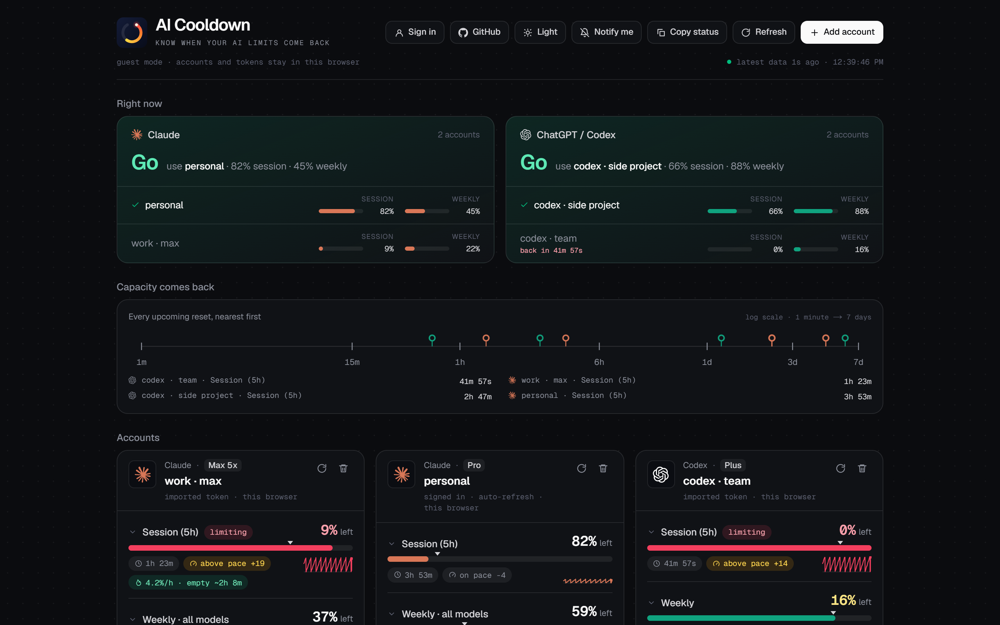
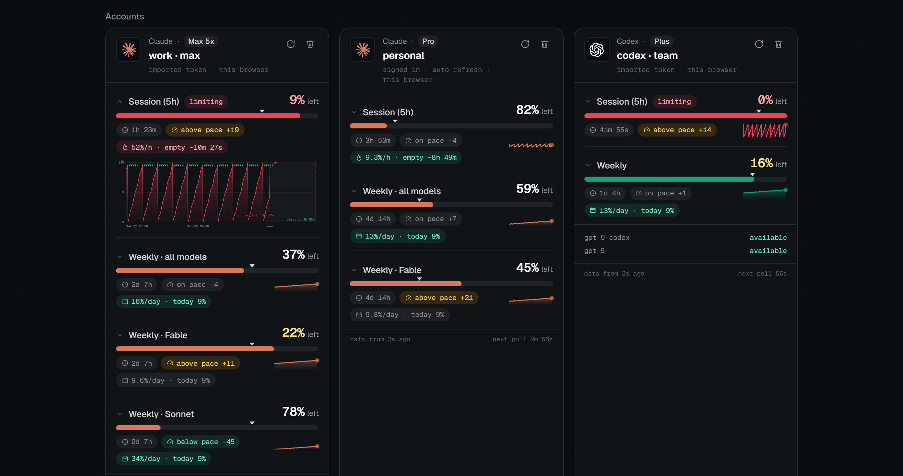
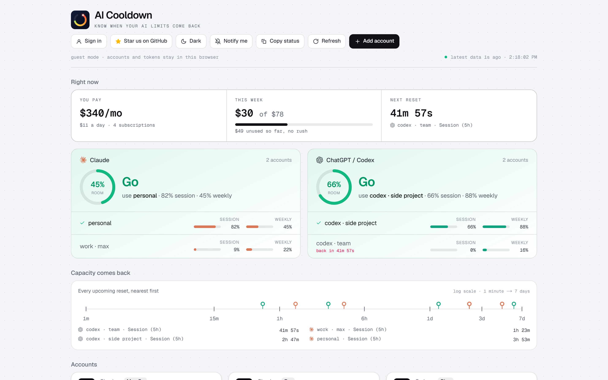

<p align="center">
  <a href="https://aicooldown.com">
    <picture>
      <source media="(prefers-color-scheme: dark)" srcset="public/logo.svg">
      
    </picture>
  </a>
</p>

<p align="center">
  <strong>Know when your AI limits come back.</strong><br>
  Every Claude and ChatGPT/Codex limit, across all your accounts, on one screen.
</p>

<p align="center">
  <a href="https://aicooldown.com">Use it now</a> ·
  <a href="#desktop-app">Desktop app</a> ·
  <a href="#teams">Teams</a> ·
  <a href="#run-it-yourself">Self-host</a> ·
  <a href="#how-it-treats-your-tokens">Security</a> ·
  <a href="https://github.com/iyedbhd/aicooldown/issues">Issues</a>
</p>

<p align="center">
  <a href="LICENSE"></a>
  
  <a href="https://github.com/iyedbhd/aicooldown/stargazers"></a>
</p>

<p align="center">
  
</p>

---

## Why this exists

If you pay for Claude and ChatGPT, maybe on more than one account, you know the feeling: you are in the middle of something, and the model tells you that you have hit a limit. Come back in a few hours. Which account still has room? When does the weekly reset land? Is the Fable limit the one blocking you, or the general one?

Both providers expose this information, but they hide it in different places and none of them show it side by side. AI Cooldown pulls every rate-limit window from every account you connect and answers the only question that matters: **can I keep working right now, and on which account?**

## What you get

**Three numbers first.** What your subscriptions add up to per month (list prices of the plans your accounts report), how much of this week's money you have actually used, and the soonest reset across everything.

**One verdict per provider.** A plain **Go** or **Wait** for Claude and for Codex, with a ring that fills with your headroom, or with how far through the wait you are. Below it, your accounts ranked by how much they have left right now.

**Every window the provider reports.** The 5-hour session, the weekly limit, and the per-model weekly limits (Fable, Opus, Sonnet), with the one that is currently limiting you flagged. Your subscription tier is shown on each account.

**A timeline of when capacity comes back.** Every upcoming reset on one log-scale line from one minute to seven days, so you can see at a glance whether relief is minutes or days away.

<p align="center">
  
</p>

**Pace, burn rate and daily budget.** A tick on each meter shows how far through the window you are. If the fill is left of the tick, you are under pace. Your recent burn rate projects whether you run dry before the reset, and weekly windows show how much you can spend per day and still make it.

**History, and what comes next.** Click any window for a 48-hour chart of your usage with reset markers, then a look ahead: a dashed projection at your current burn rate up to the reset, or to the moment you run dry if that comes first. Built from your own polling history and kept in your browser.

**Banked resets.** Both providers now hand out saved one-time resets that expire (Codex after 30 days). Each account shows how many it has banked and when the next one expires, so none lapse unused. Redeem them in the provider's own app.

**Teams.** Invite the people you work with and see, per person, the computers they connected and which accounts their Claude Code and Codex CLIs use, every Claude Code and Codex session on those computers (live ones first, with their project, branch, models, tokens and API value), the projects they work on, and how close each of their accounts is to its limits. Open any session as a chat, read it, and send the next message from the browser, whether it started in a terminal, an IDE or the Claude and Codex desktop apps; start new ones on any of your team's computers that allow it, and switch their CLI logins or start a 5-hour window on your own, all from the website, on a phone too. [More below](#teams).

**The small things.** Browser notifications when a limit resets or runs out. A countdown in the tab title so a pinned tab is enough. One-click "copy status" for pasting into chat. Rename accounts to whatever makes sense to you. Light and dark themes.

<p align="center">
  
</p>

## Getting started

The hosted version at **[aicooldown.com](https://aicooldown.com)** needs no setup. Click **Add account**, then either:

- **Sign in** with your Claude or ChatGPT account. This uses the same OAuth flow the official CLIs use, so the app can refresh its own tokens and keep polling for weeks.
- **Import a token** the CLI already saved on your machine. Paste the whole credentials file or just the access token. Imported tokens are never refreshed here (both providers rotate refresh tokens, and doing it from two places would log your CLI out), so you paste again when they expire.

| Provider | Where the CLI keeps its token | Notes |
| --- | --- | --- |
| Claude Code | `~/.claude/.credentials.json` | On macOS the live token is in Keychain (item `Claude Code-credentials`); the file can be stale. |
| Codex CLI | `~/.codex/auth.json` | Written by `codex login`. |

You can use the whole thing as a guest, with everything kept in your browser. Or create an AI Cooldown account with an email and password to have your linked accounts follow you across devices. Click your email in the header to change your password (which signs out every other device), sign out other devices, or delete the account along with everything stored for it.

## How it treats your tokens

This app needs your provider tokens to read your limits, so here is exactly what happens with them.

| | Guest (no sign-in) | Signed in |
| --- | --- | --- |
| Where linked accounts live | this browser's `localStorage` | the database, encrypted with `APP_SECRET` (AES-256-GCM) |
| Where tokens go | sent with each usage request to the site's proxy, never stored | never leave the server; the browser asks by account id |
| Other devices | no | yes |
| Polling history and theme | this browser | this browser |

The server only ever calls the providers' own usage endpoints. It reads limits and your account email, nothing else: no conversations, no messages. Passwords are scrypt-hashed, sessions are an httpOnly cookie, and there is no third-party auth service.

[Teams](#teams) add three things, all opt-in: a computer you connect sends its activity report (its sessions and project folders, git branches, models, times and token counts from the CLIs' session logs, not what the sessions say); a computer that lets what sessions say reach the website also sends session titles, and a session's conversation (and each of its images) when someone who may read it asks for it, which the server keeps encrypted like provider tokens for a week; and a remote session's prompt and output go through the server, which keeps them encrypted for 30 days.

If you would rather not have your tokens pass through someone else's server at all, that is a reasonable position. Host your own copy. It is one click on Vercel and the code is all here to read.

## Desktop app

The website can only read your limits. On your own computer, AI Cooldown can also work with the Claude Code and Codex CLIs installed there: switch which account each one is logged in with, and say hello on a schedule so a 5-hour window starts before you need it. That is the [This machine](#this-machine-switch-cli-logins-and-start-the-5-hour-clock-early) section.

The easiest way to get it is the desktop app: the dashboard in its own window, with its own icon, no browser and no setup. Download the installer for your system from the [latest release](https://github.com/iyedbhd/aicooldown/releases/latest).

| System | File | |
| --- | --- | --- |
| Windows | `aicooldown-windows-x64.exe` | Run it: AI Cooldown installs for your user, gets a Start menu entry and opens. |
| macOS, Apple Silicon | `aicooldown-macos-arm64.dmg` | Open it and drag AI Cooldown to Applications. |
| macOS, Intel | `aicooldown-macos-x64.dmg` | Open it and drag AI Cooldown to Applications. |
| Linux | `aicooldown-linux-x64.AppImage` | `chmod +x` it, then run it. If it asks for FUSE, install `libfuse2` or run it with `--appimage-extract-and-run`. |

- **It lives in the tray.** Closing the window keeps AI Cooldown running in the tray (the Dock on macOS), so scheduled hellos and notifications keep going, and the tray icon's tooltip counts down to the next reset. Starting it again brings the window back; quit from the tray icon's menu.
- **Notifications are on.** When a limit resets, crosses 90% or runs out, you get a system notification, even with the window closed; clicking it opens the window. The bell button in the header turns them off.
- **It opens at login,** straight to the tray, once installed. Turn that off with **Open at login** in the tray icon's menu (the AI Cooldown menu on macOS).
- **It keeps itself up to date.** Installed on Windows or Linux, it checks this repository's releases every few hours, downloads a new version in the background (checked against the SHA-512 in the release's `latest.yml`), and installs it the next time the window is closed, then carries on in the tray; the tray menu can also restart into it right away. On macOS it cannot replace itself without an Apple Developer ID signature, so it tells you when a new version is out and opens the download. Versions before 0.4 did not update themselves: install 0.4 once by hand.

The files are not code-signed, so the first start needs a nod from you. On Windows, SmartScreen may say it protected your PC: click **More info**, then **Run anyway**. On macOS, after dragging the app to Applications, allow it once in System Settings, Privacy & Security, or run:

```bash
xattr -dr com.apple.quarantine "/Applications/AI Cooldown.app"
```

- **Nothing private is baked in.** Releases are built by GitHub Actions from the tagged source, starting from a clean copy of the repository, and the build refuses to finish if anything private shows up in what the app ships: an `.env` value, a database, a saved login, anything shaped like a token or key. The key that encrypts tokens in the local database is generated on your machine the first time it runs. Check a download against `SHA256SUMS.txt` on the release.
- **Only your computer can reach it.** Inside, the app runs the dashboard's server on `127.0.0.1` alone, and its window shows only that dashboard: links to other sites open in your browser.
- **Your AI Cooldown account works there too.** Signing in uses your account on aicooldown.com, so the accounts you synced on the website show up in the desktop app. The app passes sign-in, synced accounts and their usage on to aicooldown.com, with only its own session cookie. As a guest, everything stays on your computer and the app talks to Claude and OpenAI directly. Set `AICOOLDOWN_ACCOUNTS_SERVER` to the `https://` address of your own copy to use that instead, or to `local` to keep accounts in a database on your computer.
- **Your data is in one folder:** `%LOCALAPPDATA%\AI Cooldown` on Windows, `~/Library/Application Support/AI Cooldown` on macOS, `~/.local/share/aicooldown` on Linux. `data` holds the saved CLI logins, schedules, the local database and its key; `window` holds the window's own storage: guest accounts, polling history and theme. Guest accounts you added in a browser tab with the single-file versions before 0.3 stayed in that browser, so add them again or sign in.
- **It can join your team.** Signed in, **Connect this computer** under This machine puts it on the [Team](#teams) page with what its CLIs work on, and you decide there whether sessions can be started on it from the browser.
- **Port 3477 taken?** Set `AICOOLDOWN_PORT`. The window's storage is kept per address, so stick to one port.

`npm run desktop` builds the installer for the system you run it on into `dist/`, with Electron and electron-builder pinned in `desktop/package.json`. Pushing a `v*` tag that matches the version in `package.json` builds all four and publishes the release.

## Teams

Open **Team** in the header; it needs an AI Cooldown account. Everyone has a personal workspace, **Just me**, with their own computers, projects and sessions. **New team** starts a team with you as its owner.

- **Invite people with a link.** Optionally bound to one email, it works once and for 7 days, and only while whoever made it may still invite people. You send it yourself: there is no email service, and emails are not verified, so a bound link only checks the email an account signed up with. Keep links private. They sign in or register, see what joining shares, and accept.
- **Roles.** The owner renames or deletes the team, changes roles and can hand the team to someone else. Admins invite and remove members. Owners and admins see the members' details and what the other owners and admins share; members see the roster and their own.
- **What owners and admins see of a member**: all of their work. Their connected computers (name, system, AI Cooldown version, online or when last seen, and whose accounts the Claude Code and Codex CLIs there are signed in with), every Claude Code and Codex session on them over the last 30 days with its title and conversation, the projects worked on there with tokens per day and model and what those tokens would cost at Anthropic's and OpenAI's API list prices, the latest reading of each linked account's limits, and the remote sessions started on their computers from this team. They can continue a member's sessions where the computer allows remote sessions. Members are managed: their computers let what sessions say reach their teams while they are members, and the invite says so before they join. Never provider tokens.
- **What owners and admins show each other**: their computers and account limits, and of their projects and sessions only what each shares, under the team's name: **What you pick** (the default: nothing until you share a project on the Projects tab, by name on all your computers, or a chat from its details) or **Everything**. What someone does not share does not reach the others at all, not even that it exists: not its sessions, tokens, titles, conversations or remote sessions, and nobody starts or continues a session in it. Someone in two teams is seen by the owners and admins of both; a remote session started from one team stays out of the other's sight.
- **Five views**: Overview (who is on what, what is live now, totals, tokens per day, limits running out, busiest projects), People (each with their latest sessions), Computers (each person's together, and which accounts are signed in where), Projects (each with who works on it where, and its latest sessions) and Sessions, over 7, 14 or 30 days. **New chat** starts a conversation on any computer you may use.

### Connect a computer

In the desktop app, or any copy running on your computer, sign in and press **Connect this computer** under This machine. The computer gets a token of its own and checks in with the server that keeps your account every minute (every 15 seconds while it allows remote sessions or lets what sessions say reach the website, every 2 seconds while someone has one of its conversations open on the website): what it is, which accounts its CLIs use and whether they can run remote sessions, plus, when it changed, an activity report it reads every 2 minutes from the CLIs' session logs (`~/.claude/projects`, `~/.codex/sessions`): per project folder, with the home folder shown as `~`, the git branch, models, times and token counts, and each session with where it ran (terminal, IDE, desktop app, `codex exec`), when it started and was last active, its models, tokens and subagents. **Disconnect** stops it for good. Signing out there disconnects it until you sign in there again, and signing out other devices (or changing your password) disconnects every computer until then.

### Sessions

The Sessions tab lists every Claude Code and Codex session on the computers you may see, live ones first (a session is live while it wrote to its log in the last 5 minutes), filtered by person, computer, project, CLI or text, as one list or grouped **by day**, **by project**, **by person** or **by computer**, each group with its sessions, tokens and API value. People, Computers and Projects link to theirs. A session shows its project, branch, computer, where it ran, when, how long, its tokens and API value per model, its subagents (Claude Code's subagents and Codex's sub-agent threads count in the session that started them), and the remote session that ran it, if one did.

What sessions say stays on the computer unless its owner lets it reach the website, under **Session content** in This machine: **Private** (the default) or **On the website**, where you read and continue your own sessions, and the owners and admins of your teams read the ones they may see (a member's, or what an owner or admin shares). It asks first. A team member's computer is on the website while they are one, and This machine says so. Such a computer sends each session's title (Claude Code's custom title or summary, Codex's thread name, or else its first prompt), and when someone who may read a session opens it, it reads the conversation from the CLI's log and sends it on its next check-in: prompts, replies, the commands run and what they printed, the latest 1,500 entries. The server keeps it encrypted for a week, and deletes every conversation from a computer as soon as it turns private. The computer hears at each check-in what its owner shares, and runs sessions for anyone else only in that.

### Chat with any session

Open a session and it reads like a chat: what was said so far, then a box for the next message. Send it, and the computer runs it as the next turn of the same conversation (`claude -p --resume`, `codex exec resume`), streams the reply back, and the conversation carries on from there, on the computer too. It reads four ways: **Chat**; **Compact**, only what was asked and answered, for a quick look on a phone; **Verbose**, every step in full with its time; and **Images**, a gallery of the images pasted with prompts or returned by tools (screenshots, image files read), each opened large with the ones before and after a tap away. Images come from the computer as they come into view, one per request: PNG, JPEG, GIF and WebP up to 2 MB, checked to be the pictures they say they are, kept encrypted for a week like conversations and deleted with them. It works for every conversation on the computer, whether it started in a terminal, an IDE, the Claude or Codex desktop apps, or here: the computer's owner can continue any of them, and the owners and admins of their teams can continue the ones they see when what sessions say reaches the website (a reply can tell what was said before; AI Cooldown 0.7 or later on the computer). The message goes with what the conversation last used (or what you pick: read only, edit files, full access, within what the computer allows; the model), and **Stop** ends a reply that runs too long. While a conversation is open its computer checks in every 2 seconds, so a message starts within a few seconds, and a finished reply notifies you when the page is in the background (with notifications on). Everything here works from a phone.

### Manage your computers

On the Computers tab, each person's computers show together, and each computer says whether Claude Code and Codex can run remote sessions there: ready, not signed in, or not installed. Give your own a name (**rename**, "Work laptop") and the website calls it that everywhere. **Logins** lists every account the CLIs are signed in with and on which computers: one account on several computers shares its 5-hour and weekly limits between them. On your own computers, **Manage logins and hellos** does from anywhere what This machine does on the computer: switch the login a CLI uses to one of the logins saved there, save the one it uses now, say hello to start a login's 5-hour window, and schedule a hello (at the next reset, after every reset, or at a time) or cancel one. The computer does it on its next check-in, within seconds while the page is open, and the card shows how each went. Only a computer's owner sends these; deleting a saved login stays on the computer.

Remote sessions run the CLIs installed on the computer, found on PATH, in the login shell's PATH and the usual install folders (a desktop app started from the Dock gets a bare PATH), or else the copies the Claude and Codex desktop apps keep for themselves. Codex shares its login with the Codex app. Claude Code in the Claude desktop app signs in on its own, and that login is not the CLI's: if This machine says Claude Code is not signed in, run the command it shows once in a terminal there (`claude auth login`, with the desktop app's copy when there is no other).

### Remote Claude Code and Codex sessions

What sessions started from the browser may do on a computer is set on that computer, under This machine, and nowhere else: the server cannot change it, and the computer checks every session against it.

| Setting | Claude Code runs with | Codex runs with | Sessions can |
| --- | --- | --- | --- |
| Off (the default) | | | not start |
| Read only | `--permission-mode plan` | `--sandbox read-only` | read the project and answer or plan |
| Edit files | `--permission-mode acceptEdits` | `--sandbox workspace-write` | also edit files in the project (Codex also runs commands in its sandbox, without network) |
| Full access | `--permission-mode bypassPermissions` | `--dangerously-bypass-approvals-and-sandbox` | also run any command, without asking |

Where it is allowed, the computer's owner and the owners and admins of their teams start a session from the Team page (**New chat**): the computer, Claude Code or Codex, one of the projects it reported, what the session may do, the model, and the prompt. The computer picks it up within seconds, runs `claude -p` or `codex exec` in that project as the account that CLI is signed in with (the prompt goes in on standard input, never on a command line) and streams the output back. Cancel it while it runs, or continue the conversation when it is done. On the computer, This machine lists the sessions it ran, a notification says when someone else starts one, **Stop** ends it, and lowering the setting ends a session that asked for more. Only projects the computer reported can be targeted, only conversations started this way or the computer's own (as above) can be continued, and a session stops after 30 minutes. A computer takes up to 3 waiting sessions at a time, and one person starts up to 100 a day.

A computer runs what the server it is connected to hands it, within its setting: allow remote sessions only on a computer you would trust that server, and the owners and admins of your teams, to run Claude Code or Codex on.

Deploy the website before handing out a desktop build with these features: the desktop app's team pages and check-ins go to aicooldown.com (or your `AICOOLDOWN_ACCOUNTS_SERVER`).

## Run it yourself

```bash
git clone https://github.com/iyedbhd/aicooldown.git
cd aicooldown
npm install
npm run dev
```

Open http://localhost:3000. Guest mode works with zero configuration. Sign-up works too: it creates a SQLite file at `data/aicooldown.db` and uses a development encryption key with a console warning. `npm run dev` keeps to that file even when `.env.local` names a database server, since a `.env.local` pulled from Vercel points at production; set `AICOOLDOWN_REMOTE_DB=1` to use that server on purpose.

### This machine: switch CLI logins and start the 5-hour clock early

When the app runs on your own computer (the [desktop app](#desktop-app), `npm run dev`, or `AICOOLDOWN_LOCAL=1` with `npm start`), a **This machine** section appears under your accounts. It works with the Claude Code and Codex CLIs you run in a terminal here. Claude Code in the Claude desktop app signs in on its own: that login is not a CLI login, and it is not shown, saved or switched here. If the panel says the CLI is not signed in, run `claude auth login` (or `codex login`) in a terminal.

- **Save current login** keeps a copy of the login the CLI uses now. To add another account, run `claude auth login` (or `codex login`) with it and save that too. Do not log out first: logging out can revoke the saved login.
- **Switch to** makes a saved login the one the CLI uses. The outgoing login is saved first, with any tokens the CLI rotated, so nothing is lost. Restart running CLI sessions afterwards. While a saved login is in use, its copy follows the CLI's token refreshes whenever the dashboard is open.
- **Say hello** sends `hello` through the CLI as that login (Haiku for Claude). A 5-hour session window starts at your first message, so saying hello before you need the account means it resets sooner.
- **Schedule** sends that hello at the next reset, after every reset (keeping a fresh window rolling), or at a time you pick. Schedules run in the server process and survive restarts; one missed while the server was down fires when it starts again.

Saved logins live in `cli-profiles/` and schedules in `local-schedules.json` inside the data folder (`./data`, the desktop app's `data` folder, or wherever `AICOOLDOWN_DATA_DIR` points), on your machine only. The section is never served on Vercel, and only answers requests from this computer: `npm run dev` and `npm start` listen on your network too, so every request's actual network peer is checked, not just its Host header. On a computer shared with other accounts, those accounts can reach it too. Claude switching needs the file-based login (`~/.claude/.credentials.json`, Windows and Linux); on macOS Claude Code keeps it in the Keychain instead.

To tell Claude logins apart, the app asks Anthropic whose account each token is (the profile request Claude Code itself makes, once per token). The account named in `~/.claude.json` is not enough, because the Claude desktop app writes its own account there too. A login this can't identify, because its access token expired before the app saw it, is not saved or switched until you run `claude` once to refresh it.

### Deploy

[](https://vercel.com/new/clone?repository-url=https://github.com/iyedbhd/aicooldown&env=APP_SECRET,LIBSQL_URL,LIBSQL_AUTH_TOKEN)

| Variable | Required | What |
| --- | --- | --- |
| `APP_SECRET` | yes, in production | 32+ random characters. Encrypts stored provider tokens. Changing it makes existing stored tokens unreadable. |
| `LIBSQL_URL` | on serverless hosts | libSQL database URL, e.g. a free [Turso](https://turso.tech) database (`libsql://...`). Defaults to `file:data/aicooldown.db`, which does not persist on Vercel. Vercel's Turso integration sets `TURSO_DATABASE_URL` and `TURSO_AUTH_TOKEN` instead, and those work too. |
| `LIBSQL_AUTH_TOKEN` | with Turso | The database auth token. |

Any host that runs Next.js works: Vercel, Netlify, a Node server, Docker. The API routes need outbound HTTPS to `api.anthropic.com`, `platform.claude.com`, `chatgpt.com` and `auth.openai.com`. Copy `.env.example` to `.env.local` to get started.

Keep production's database and `APP_SECRET` to production. `npm run dev` stays on a local file (see above), but `npm start` uses whatever `.env.local` says. On Vercel, give Preview deployments their own database, or none, and keep Git Fork Protection on, so a pull request's build never reaches production's data.

What a copy of the database would show: account and invite emails, scrypt password hashes, team names and roles, linked accounts' labels and plans, the project folders and models of remote sessions, and when things happened. Sessions, devices and invites are stored as hashes of their tokens. Provider tokens, what computers report (names, projects, sessions), usage readings, remote sessions' prompts, output and results, and conversations are encrypted with `APP_SECRET`.

## Under the hood

On a schedule (Claude every 3 minutes, Codex every minute) the browser asks `/api/usage` for each account. The server calls the provider's usage endpoint, refreshes tokens it owns when they are about to expire, keeps a short in-memory cache per token so repeated requests do not hit the provider, and if the provider answers 429 it returns the last good copy marked stale while the client backs off (5, 10, 20, then 30 minutes).

Anthropic rate-limits its usage endpoint per token, sends no Retry-After header, and a tripped limit can last hours. If a card says "rate-limiting this token", the dashboard keeps showing the last data it got. Running several usage tools against the same token at once is the usual cause.

These are the endpoints the official CLIs use. They are not publicly documented and may change without notice.

| Provider | Usage | Auth |
| --- | --- | --- |
| Claude | `GET https://api.anthropic.com/api/oauth/usage` (+ `/api/oauth/profile` for the email) | `https://claude.ai/oauth/authorize` → `https://platform.claude.com/v1/oauth/token` |
| Codex | `GET https://chatgpt.com/backend-api/wham/usage` | `https://auth.openai.com/oauth/authorize` → `https://auth.openai.com/oauth/token` |

```
src/app/api/usage            usage for a stored account (by id) or a guest account (tokens in body)
src/app/api/accounts         signed-in CRUD for linked accounts
src/app/api/auth/*           register, login, logout, me, PKCE code exchange
src/app/api/identity         account email / plan for a guest token
src/app/api/teams, invites   teams, roles, invite links, and everything the team page shows
src/app/api/devices, agent   connecting a computer; the API it checks in with, by its own token
src/app/api/runs             remote sessions: start, follow, cancel
src/app/api/sessions         a session's conversation and its images: ask its computer for them, then read them
src/app/api/sharing          what an owner or admin shows the other owners and admins of their teams
src/app/api/devices/commands your computers' CLI logins and hellos, from the website
src/lib/providers/*.ts       per-provider endpoints and response normalization
src/lib/server/usage.ts      fetch + refresh-on-expiry + cache, shared by both callers
src/lib/server/{db,auth,accounts,crypto}.ts
                             libSQL schema, sessions, encrypted account storage
src/lib/server/{teams,sharing,devices,runs,transcripts,images,commands,workspace}.ts
                             who may see and do what, connected computers, remote sessions, conversations, commands
src/lib/server/local/{device,activity,transcript,runner}.ts
                             on the computer: checking in, reading the CLIs' session logs, running sessions
src/lib/store.ts             browser-side account store: localStorage or the API
src/components/*             dashboard UI
desktop/                     the desktop app: its Electron main process, build script and installer smoke test
```

Built with Next.js 16, React 19, Tailwind 4 and libSQL. The name, tagline and domain live in `src/lib/site.ts`. The logo is drawn in `src/lib/brand.ts`: `npm run brand` writes every logo file from it (`public/`, the favicons in `src/app/`, the desktop app's icon), and the `/brand` page shows them with the color tokens.

## Contributing

Bug reports, ideas and pull requests are all welcome. The most useful things right now:

- A provider response that the app parses wrongly or does not show (a redacted JSON sample in an issue is perfect).
- Any rate-limit behaviour you see that the backoff does not handle well.
- Support for another provider that exposes its limits.

Keep changes focused and run `npm run lint` and `npm run build` before opening a PR.

## If this saved you a "come back in 3 hours"

A star on the repo genuinely helps other people find it, and it is the easiest way to say the tool was useful. Thank you.

<p align="center">
  <a href="https://github.com/iyedbhd/aicooldown/stargazers">⭐ Star AI Cooldown on GitHub</a>
</p>

## Disclaimer and license

Not affiliated with Anthropic or OpenAI. The Claude and OpenAI marks shown next to accounts are their owners' trademarks, used only to identify each provider (glyphs via [Simple Icons](https://simpleicons.org)). The app reads your own account's usage data with your own credentials. Keep your tokens private: anyone who has them can act as you.

MIT. See [LICENSE](LICENSE).
